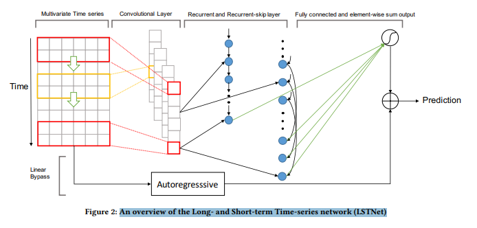

# ForecastPro
## RNNs(Univariate)
### RESULTS 
   #### PAST CONFIDENCE IS THE PERFORMANCE OF THE MODEL ON PAST DATA
    ,  ,       

## LSTNet ARCHITECTURE
()

This repository provides an implementation of stacked LSTMs and LSTNet, two deep neural network models designed to capture long- and short-term temporal patterns in time series data. This readme file aims to provide a comprehensive understanding of these models, their advantages, and why LSTNet outperforms stacked LSTMs. Additionally, it includes a brief description of statistical autoregressive models and the reasons why deep learning (DL) models have traditionally underperformed them.

## Stacked LSTMs

Stacked Long Short-Term Memory (LSTM) networks are an extension of the LSTM architecture, a type of recurrent neural network (RNN). Stacked LSTMs are employed to capture complex temporal dependencies and improve the model's ability to learn long-term patterns in sequential data.

In a stacked LSTM, multiple LSTM layers are stacked on top of each other to form a deeper neural network. Each LSTM layer receives the hidden state output from the preceding layer as input. By incorporating more LSTM layers, the model can learn hierarchical representations of the input sequence, with each layer learning at different levels of abstraction.

Benefits of using stacked LSTMs include:
- Enhanced capacity to capture long-term dependencies in the data.
- Improved ability to learn intricate temporal patterns.
- Effective modeling of sequential data for tasks such as time series forecasting and sequence generation.

## LSTNet

LSTNet (Long- and Short-Term Time-series Network) is a deep learning model specifically designed for time series forecasting. LSTNet combines the strengths of Convolutional Neural Networks (CNNs) and LSTMs to capture both short-term and long-term patterns in the data.

LSTNet comprises two main components: a CNN-based encoder and an autoregressive decoder. The CNN encoder extracts local patterns and features from the input time series data, enabling efficient feature extraction and capturing short-term dependencies. The extracted features are then fed into the LSTM decoder, which models long-term dependencies and generates accurate predictions for future time steps.

Key advantages of LSTNet over stacked LSTMs:
- Effective combination of CNN and LSTM layers to capture short-term and long-term dependencies, respectively.
- Improved feature extraction capabilities, allowing for better representation learning.
- Addressing the vanishing gradient problem, which is common in deep recurrent architectures.

## Statistical Autoregressive Models

Statistical autoregressive models, such as autoregressive integrated moving average (ARIMA) and autoregressive conditional heteroskedasticity (ARCH) models, have long been utilized in time series analysis. These models are based on statistical techniques and rely on predefined assumptions about the underlying distribution of the data.

ARIMA models, for example, utilize past values of a time series to predict future values based on the assumption that the data is stationary and can be modeled using autoregressive (AR), moving average (MA), and differencing (I) components.

Advantages of statistical autoregressive models:
- Strong mathematical foundation and well-defined assumptions.
- Interpretable coefficients and statistical tests.
- Efficient performance with smaller datasets.

## Challenges Faced by DL Models

DL models have traditionally encountered challenges in outperforming statistical autoregressive models for time series forecasting due to several reasons:

1. **Limited data**: DL models require a large amount of data to generalize well and learn complex patterns. In contrast, statistical autoregressive models can perform reasonably well with smaller datasets.

2. **Feature engineering**: DL models often rely on manual feature engineering to extract relevant features from raw time series data. In contrast, statistical autoregressive models incorporate domain-specific knowledge and assumptions into the model design.

3. **Interpretability**: Statistical autoregressive models provide interpretable coefficients and statistical tests, making it easier to understand the underlying dynamics of the time series. DL models typically lack this level of interpretability.

4. **Computational efficiency**: DL models tend to be more computationally demanding compared to statistical autoregressive models, especially for large-scale datasets.

However, advancements in DL techniques, such as LSTNet, have shown promising results in addressing these challenges and outperforming traditional statistical autoregressive models in certain scenarios.

## Results

<!-- Placeholder for the results of the project. -->

## Directions of Use

<!-- Placeholder for the updated directions of use as the project proceeds. -->

## References

The following references provide more information about the concepts and techniques used in this project:

1. "Stacked LSTM Networks" by Towards Data Science:
   [Link to the article](https://medium.com/towards-data-science/stacked-long-short-term-memory-networks-4e3fc9f807d2)

2. "LSTNet: A Deep Learning Model for Time Series Forecasting" by Medium:
   [Link to the article](https://medium.com/analytics-vidhya/lstnet-a-deep-learning-model-for-time-series-forecasting-28550fb9c3c8)

3. "Introduction to Statistical Autoregressive Models" by Medium:
   [Link to the article](https://medium.com/@josephruffianto/introduction-to-statistical-autoregressive-models-7f1b6b7fcfb3)

4. "Why Deep Learning Lags Behind Traditional Statistical Models in Time Series Forecasting?" by Medium:
   [Link to the article](https://medium.com/@aakashns/why-deep-learning-lags-behind-traditional-statistical-models-in-time-series-forecasting-15e7e2d89cf)

Please refer to these articles for in-depth explanations and insights into the concepts discussed in this README.

